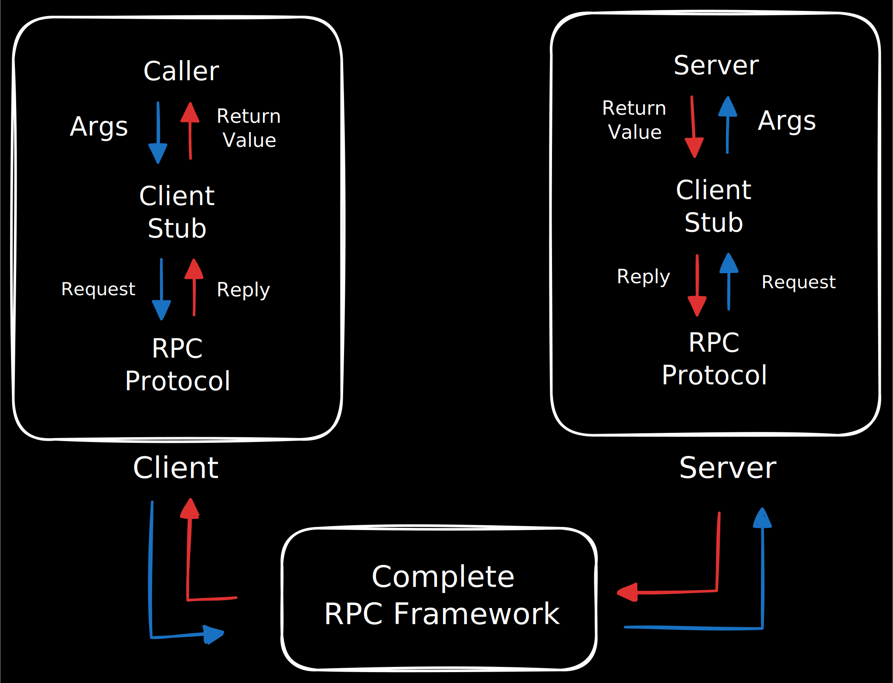

# Rust gRPC implementation

Some sample code on working with gRPC using Rust as a client / server language. The Aim is to understand implementation details of the RPC / gRPC "protocols" for creating more performant microservices or IOT systems that use these remote calls for performant M2M communication,  

## RCPs - Remote Procedure Calls

A Remote Procedure Call (RPC) is a protocol that allows a program (the client) to cause a procedure (a function or method) to execute in a different address space (the server), ***without the programmer explicitly coding the details for the remote interaction.***

> The fundamental idea of RPC is to make network communication look and feel like a simple, **local function call.** RPC is not technically a protocol—it is better thought of as a general mechanism for structuring distributed systems. 

> [!NOTE]
> RPC is popular because it is based on the semantics of a local procedure call—the application program makes a call into a procedure without regard for whether it is local or remote and blocks until the call returns. An application developer can be largely unaware of whether the procedure is local or remote, simplifying his task considerably.

<!-- Add the base RPC image -->

  

### Client Side 

When performing an RPC call, the client goes through some steps: 

1. **Procedure call**: Client app calls a **client stub** -> Local placeholder to the remote function, having the same signature as the method / function being called remotely.

2. **Marshalling (Serialization)**: The client stub takes the local function parameters and marshals (serializes) them into a format suitable for transmission over the network (e.g., a compact binary format like Protocol Buffers, or a text format like XML/JSON).

3. **Transmission:** The client's RPC runtime system sends the marshaled message, which includes the function ID and the parameters, to the server's machine.

### Server Side

The other half of the procedure call also goes through specifi steps

1. **Reception:** The server's RPC runtime system receives the message.

2. **Dispatch:** It passes the message to a server skeleton (sometimes called the dispatcher). The skeleton is responsible for locating the actual procedure on the server.

3. **Unmarshalling (Deserialization):** The server skeleton unmarshals (deserializes) the network message back into the ***server's native data types*** and formats, reconstructing the original parameters.

4. **Procedure Execution:** The server skeleton calls the actual remote procedure using the reconstructed parameters.

5. **Return and Reverse Flow:** When the remote procedure completes, the result is marshalled and sent back to the client, following the same steps in reverse (unmarshalling by the client stub, and the client application receives the result).